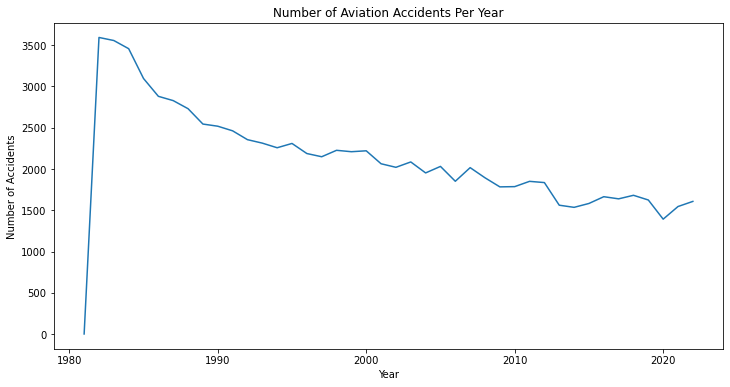
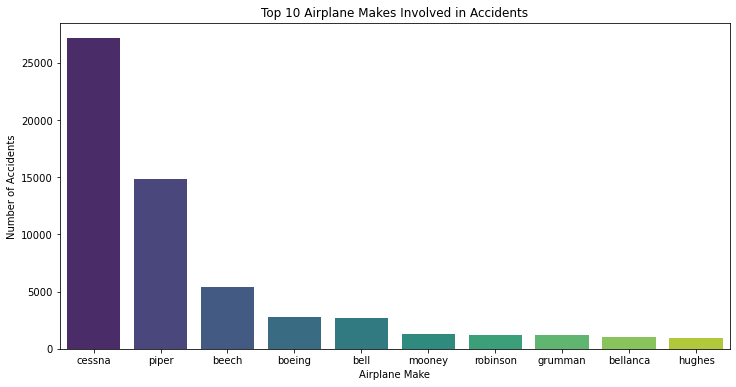

**PROJECT OVERVIEW**

This project aims to carry out analyses on past aviation accidents and identify airplane makes and models

**BUSINESS UNDERSTANDING**

As part of its strategic growth plan, our company is seeking to diversify into the aviation industry by purchasing and operating aircraft for both commercial and private enterprises. 
The insights that have been obtained after analysis will guide the aviation division in making informed investment decisions and developing effective risk management strategies for fleet acquisition.

KEY BUSINESS QUESTIONS
1.Which airplane makes have the highest and lowest risk profile in terms of aviation accidents?
2.Which airplane models experienced the least number of fatal injuries in aviation accidents?
3.Does the number of engines impact safety on flights?

**DATA UNDERSTANDING AND ANALYSIS**

The dataset was obtained from Kaggle(https://www.kaggle.com/datasets/prathamsharma123/aviation-accidents-and-incidents-ntsb-faa-waas?resource=download&select=airline_accidents.csv). 

It was compiled by the National Transport and Safety Board.

The dataset contains data on aviation accidents over the years.
Columns that are key to our analysis include:
    Event.Id 
    Make
    Model
    Total.Fatal.Injuries
    Total.Uninjured

Columns with too many missing values that are not used in our analysis are removed entirely(Latitude, Longitude, Airport.Code and Airport.Name)

**VISUALIZATIONS**

1.Number of Accidents over the Years
This visualization shows the trensd in number of aviation accidents over the years

2.Number of Accidents according to The Number of Engines
This visualization shows how the number of engines impacts flight safety.

3.Top 10 Airplane Makes Involved In Accidents
This visualization shows the top 10 airplane makes involved in aviation accidents

**CONCLUSION**

Based on the analysis, insights into aircraft safety and risk patterns were obtained, helping the company make informed decisions as it enters the aviation industry. By identifying aircraft with lower accident rates and understanding historical risk trends, the company can minimize operational risks, improve safety, and strategically select aircraft makes and models that align with its business objectives.

**Jupyter notebook**

**Presentation PDF**

**Analysis Dashboard**
The link to the accident analysis dashboard:(https://public.tableau.com/views/NTSBAccidentsAnalysis/AirplaneModelsWiththeLeastNumberofFatalInjuries?:language=en-US&:sid=&:redirect=auth&:display_count=n&:origin=viz_share_link)

